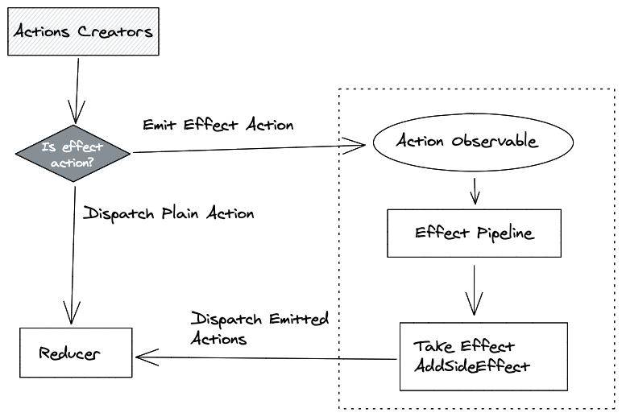

## Architecture overview

When a RjObject is consumed an **action observable** `Observable<EffectAction>` is created this rapresent the stream of effect actions dispatched from effect action creators.

The original action observable are passed into `effectPipeline` which return the same contract of effect actions stream.

From action observable a **dispatch observable** is created according to `takeEffect` and `addSideEffect` options.

The actions emitted from dispatch observable are dispatched on reducer.



## Take effect

Take effect abstraction describe how your effect actions stream are handled by RocketJump.
You can configured them using the `takeEffect` property in **rj** constructor.
You can write your own take effect function using [rxjs](https://rxjs.dev) or you can use
the standard take effects provided by RocketJump passing it a _string_.
Standard take effects are designed to works with standard effect action:

- `RUN` created by `run(...params)` trigger the effect function using `params` as input.
- `CANCEL` created by `cancel()` stop onging effect.
- `CELAN` created by `clean()` also stop onging effect.

Standard take effects are:

- `latest`: **(the default one)** take only the last effect you run, cancel all previous pending effect.
- `every`: take all effects you run, the dispatched _FAILURE_ / _SUCCESS_ follow the **completation order**
  of your effect (don't use the if order matter). If a _CANCEL_ or _CLEAN_ are emitted **ALL** ongoing effects
  are canceled.
- `exhaust`: execute one run at time if an effect is pending and you emit a run it's ignored.
- `concatLatest`: execute one run at time if an effect is pending and you emit a run the **LAST** run is buffered
  and then executed. This useful in "auto save" scenarios you spawn run very often but you want
  to avoid concurrent save but, on the other hand, you want your data update with last version.

Some standard take effects have a "group by" version, in other words the description above
is true but you can decuple it into different "channels".
To provide group by standard take effect you have to provide a fixed lenght list
with this signature:

```ts
[takeEffectName: string, (action: EffectActions) => any]
```

The first argument is the take effect name, the second is a function
that extracts the key for each effect action.

Standard take effects group by are:

- `groupBy` the group by version of `latest`
- `groupByExhaust` the group by version of `latest`
- `groupByConcatLatest` the group by version of `concatLatest`

## Write custom take effects

As mentioned before you can write custom take effects.
To write custom take effect you should have a basic understening of how rxjs works.
As expiration you can checkout how standard take effects are implemented
TODO: Link master [here](https://github.com/inmagik/react-rocketjump/blob/v3/src/core/effect/takeEffectsHandlers.ts).

The take effect handler has this signature:

```ts
interface TakeEffectBag {
  effect: EffectFn
  getEffectCaller: GetEffectCallerFn
  prefix: string
}

interface StateObservable<S = any> extends Observable<S> {
  value: S
}

type TakeEffectHanlder = (
  actionsObservable: Observable<EffectAction>,
  stateObservable: StateObservable,
  effectBag: TakeEffectBag,
  ...extraArgs: any[]
) => Observable<Action>
```

One important note to understand is that (in order to make RockeJump works)
is that at first instance you need to **FILTER** which effect actions you want to handle.
This because multiple effects can live in a single RjObject so you have to handle only
you part.

Ok try to write a real example. Take the counter RjObject from previous example
and make it inc or dec the counter after a given ammount of time.

```jsx
import { rj, useRj } from 'react-rocketjump'
import { filter, mergeMap, delay } from 'rxjs/operators'
import { of } from 'rxjs'

export const CounterState = rj({
  // NOTE: In this example we ignore effect
  effect: () => Promise.reject(),
  // Add inc() and dec() effect action creators
  actions: (currentActions) => ({
    dec: (quantity, wait = 0) =>
      makeEffectAction('DEC', [quantity], {
        wait,
      }),
    inc: (quantity, wait = 0) =>
      makeEffectAction('INC', [quantity], {
        wait,
      }),
  }),
  takeEffect: (effectActionObservable) => {
    // pipe the streams of effect actions
    return effectActionObservable.pipe(
      // As describe above first filter the effect types we want to handle
      // in cour case only INC and DEC
      filter((action) => ['INC', 'DEC'].includes(action.type)),
      // we use mergeMap cuase we want to handle ALL INC and DEC
      // if for example we want to take only the last INC and DEC
      // we can use switchMap, while if orders of request means
      // we can use concatMap
      mergeMap((action) => {
        // Create a new observable with the same type but using
        // the first param as action payload
        return (
          of({
            type: action.type,
            payload: action.payload.params[0],
          })
            // final we delay the dispatch by given wait time
            .pipe(delay(action.meta.wait))
        )
      })
    )
  },
  // Swap default root reducer implementation with a simple counter
  reducer: (currentReducer) => (state = 0, action) => {
    if (action.type === 'INC') {
      return state + action.payload
    }
    if (action.type === 'DEC') {
      return state - action.payload
    }
    return state
  },
})

function Conter() {
  const [counter, { inc, dec }] = useRj(CounterState)

  return (
    <div>
      <button onClick={() => inc(1)}>INC</button>
      <button onClick={() => inc(2, 3 * 1000)}>INC 2 after 3 seconds</button>
      <h1>{counter}</h1>
      <button onClick={() => dec(1)}>DEC</button>
      <button onClick={() => dec(5, 1 * 1000)}>DEC 5 after 1 second</button>
    </div>
  )
}
```

## Add side effects

When using `takeEffect` option the default take effect is replaced.
If instead you want to add another side effect and keep the take effect working
use `addSideEffect` option, the signature and the behavior are identical to
a custom take effect.